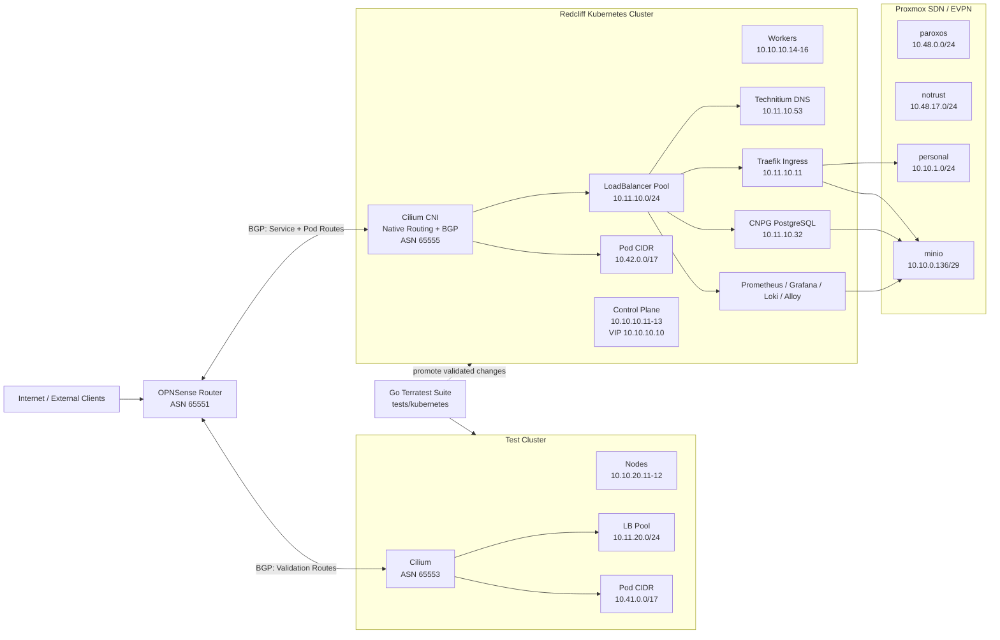

# Network Architecture

## High-Level Topology Diagram



## Core Networks And Routing

- OPNSense is the main router/firewall and BGP peer for Kubernetes service routes.
- Redcliff Kubernetes nodes are on `10.10.10.0/24`.
- Test Kubernetes nodes are on `10.10.20.0/24`.
- Redcliff LoadBalancer pool is `10.11.10.1/24`.
- Test LoadBalancer pool is `10.11.20.1/24`.
- Cilium uses native routing and advertises both service IPs and pod CIDRs over BGP.
- Proxmox SDN resources are managed in IaC under `terraform/networking/proxmox_sdn` and orchestrated via `terragrunt/networking`.

## NetBox And Proxmox SDN From IaC

Networking metadata and SDN are codified in Terraform:

- NetBox manages sites, prefixes, VLAN metadata, ASN/VRF definitions, and key IP addresses.
- Proxmox EVPN controller/zone and multiple VNets are managed from code.

Implemented SDN VNets include:

- `paroxos`: `10.48.0.0/24`
- `notrust`: `10.48.17.0/24`
- `personal`: `10.10.1.0/24`
- `minio`: `10.10.0.136/29`

## Kubernetes Cluster Architecture

### Redcliff Cluster

- Nodes: `10.10.10.11` to `10.10.10.16`.
- KubeVIP control plane endpoint: `10.10.10.10`.
- Cilium native routing pod CIDR: `10.42.0.0/17`.
- Cilium BGP ASN: `65555`.
- OPNSense peer ASN: `65551`.
- Talos and Kubernetes versions are configured in `terragrunt/redcliff/env.hcl`.

Key Redcliff LoadBalancer IP allocations:

- `10.11.10.11`: ingress controller.
- `10.11.10.12`: monitoring endpoint.
- `10.11.10.32`: PostgreSQL service.
- `10.11.10.53`: Technitium DNS.

### Test Cluster

- Nodes: `10.10.20.11` and `10.10.20.12`.
- KubeVIP: `10.10.20.10`.
- Pod CIDR: `10.41.0.0/17`.
- LoadBalancer pool: `10.11.20.1/24`.
- Cilium BGP ASN: `65553`.
- This is an ephemeral validation cluster used with the Go-based test suite before promoting changes to redcliff (production).
- Talos and Kubernetes versions are configured in `terragrunt/test/env.hcl`.

## Request Flow

```
External request (HTTPS)
  |
  v
OPNSense forwards traffic to the ingress LoadBalancer IP
  |
  v
Traefik routes by host/path using Kubernetes ingress resources
  |
  +--> authentik.homelab.example
  +--> grafana.homelab.example
  +--> other hostnames for non-Kubernetes services
```

Local DNS flow:

- Technitium DNS serves internal records.
- External DNS updates records for Kubernetes services.

## How BGP Routing Works For Services And Pods

```
Service of type LoadBalancer is created or pod CIDR is allocated
  |
  v
Cilium allocates service IPs from the cluster pool and pod IPs from the pod CIDR
  |
  v
Cilium advertises both route types via BGP to OPNSense
  |
  v
OPNSense installs route toward the active node
  |
  v
Traffic reaches service without L2 announcer dependency
```

## Storage, State, And Secrets

- Longhorn provides persistent volumes for stateful Kubernetes workloads.
- CNPG PostgreSQL provides shared databases for platform applications.
- MinIO remains active for:
  - Terragrunt S3 backend state.
  - Loki object storage.
  - CNPG backups.
  - Longhorn backup target.
- Infisical is the central secret source for Terraform providers and application credentials.

## Terragrunt Stack Orchestration

### Redcliff

- `terragrunt/redcliff/cluster`: `talos_cluster` -> `bootstrap_init` -> `bootstrap_final`
- `terragrunt/redcliff/applications`: CNPG/PostgreSQL, gateway, Authentik, Infisical, Technitium, External DNS
- `terragrunt/redcliff/observability`: Loki, Grafana, Alloy

### Additional Stacks

- `terragrunt/networking`: NetBox and Proxmox SDN resources
- `terragrunt/test/cluster`: test cluster lifecycle for integration tests

# GitHub Actions Architecture

All workflows run on a self-hosted runner to access private network dependencies.

## Terragrunt Workflow

` .github/workflows/terragrunt.yaml `:

- Pull requests run stack `plan`.
- Pushes to `main` run stack `apply`.
- Path filters target `cluster`, `applications`, and `observability` independently.
- Concurrency prevents overlapping runs for the same PR or main branch apply lane.

## Kubernetes Test Workflow
Used for running integration tests against the test cluster:
` .github/workflows/test-kubernetes.yaml `:

- Manual dispatch with boolean `teardown` input.
- Uses targets from `tests/Makefile`.
- `teardown=false` runs without teardown for debugging.
- Always produces a test report summary.

## Public Mirror Workflow

` .github/workflows/public-mirror.yaml `:

- Runs on schedule and manual dispatch.
- Uses `git filter-repo` string replacements.
- Pushes rewritten history to the public mirror repository, with sensitive strings scrubbed.

# Observability Architecture

- Prometheus stack is deployed during cluster bootstrap.
- Grafana and Loki are deployed from `terraform/observability`.
- Alloy is deployed in-cluster and also installed on all non-Kubernetes hosts via Ansible for centralized logging and monitoring.
- Grafana uses Authentik for SSO and integrates Prometheus/Loki data sources.
